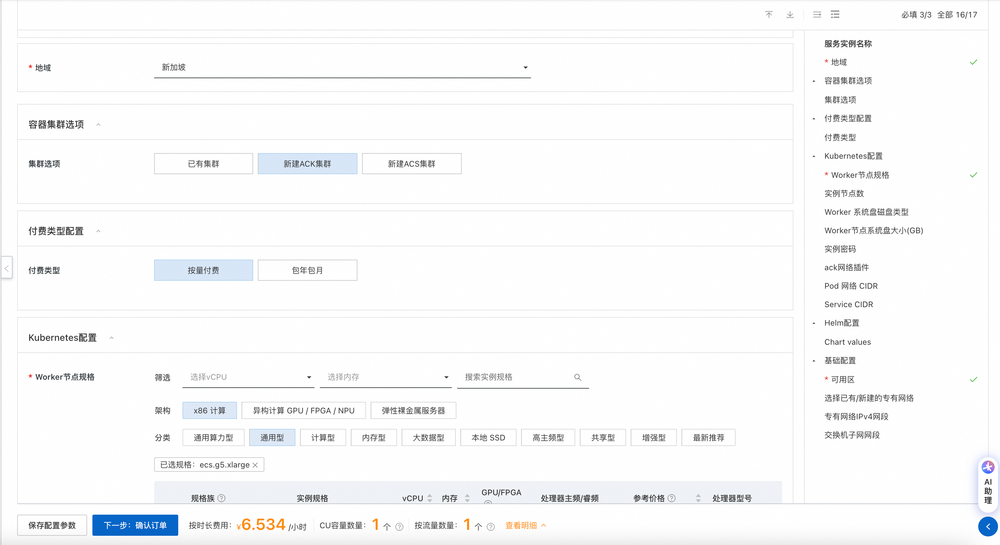
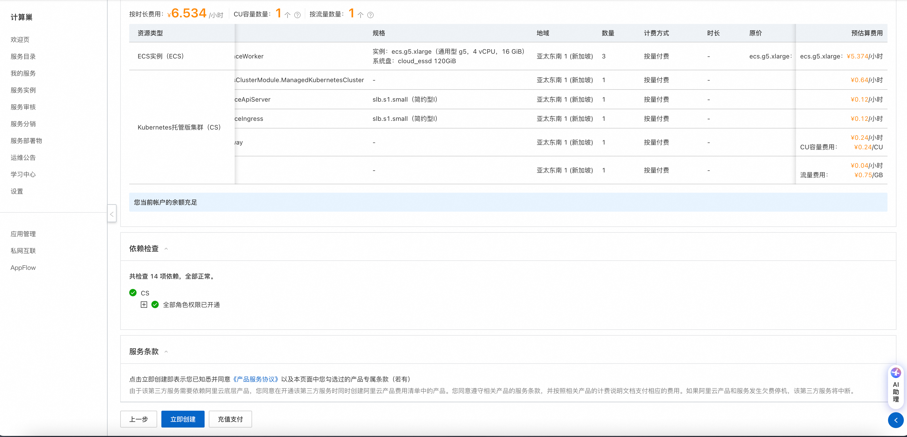
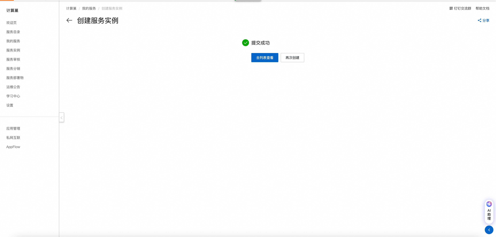
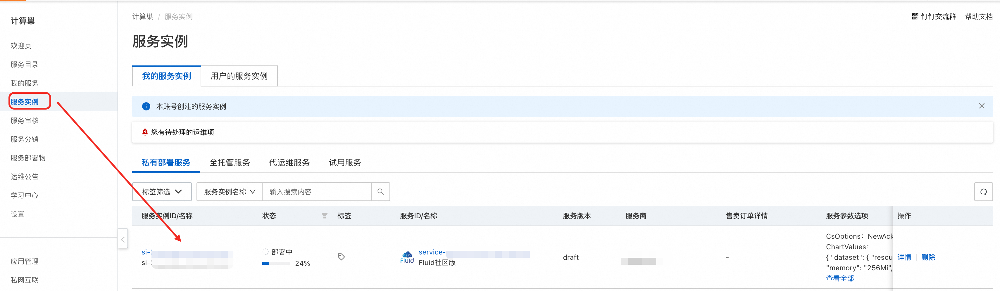

# Fuild计算巢快速部署

>**免责声明：**本服务由第三方提供，我们尽力确保其安全性、准确性和可靠性，但无法保证其完全免于故障、中断、错误或攻击。因此，本公司在此声明：对于本服务的内容、准确性、完整性、可靠性、适用性以及及时性不作任何陈述、保证或承诺，不对您使用本服务所产生的任何直接或间接的损失或损害承担任何责任；对于您通过本服务访问的第三方网站、应用程序、产品和服务，不对其内容、准确性、完整性、可靠性、适用性以及及时性承担任何责任，您应自行承担使用后果产生的风险和责任；对于因您使用本服务而产生的任何损失、损害，包括但不限于直接损失、间接损失、利润损失、商誉损失、数据损失或其他经济损失，不承担任何责任，即使本公司事先已被告知可能存在此类损失或损害的可能性；我们保留不时修改本声明的权利，因此请您在使用本服务前定期检查本声明。如果您对本声明或本服务存在任何问题或疑问，请联系我们。

## 概述

Fluid 是一个开源的 Kubernetes 原生分布式数据集编排器和加速器，专为大数据和 AI 应用等数据密集型应用设计。 它由 云原生计算基金会（CNCF）托管，作为一个沙箱项目。 Fluid 可以将分布式缓存系统（如 Alluxio 和 JuiceFS）转换为具有自我管理、弹性扩展和自我修复能力的可观察缓存服务， 并通过支持数据集操作来实现这一点。同时，通过数据缓存位置信息，Fluid 可以为使用数据集的应用提供数据亲和调度。
更多信息，请查看[官网](https://github.com/fluid-cloudnative) 。

## 前提条件

部署Fluid社区版服务实例，需要对部分阿里云资源进行访问和创建操作。因此您的账号需要包含如下资源的权限。
  **说明**：当您的账号是RAM账号时，才需要添加此权限。

| 权限策略名称                          | 备注                     |
|---------------------------------|------------------------|
| AliyunECSFullAccess             | 管理云服务器服务（ECS）的权限       |
| AliyunCSFullAccess              | 管理容器服务（CS）的权限|
| AliyunVPCFullAccess             | 管理专有网络（VPC）的权限         |
| AliyunROSFullAccess             | 管理资源编排服务（ROS）的权限       |
| AliyunComputeNestUserFullAccess | 管理计算巢服务（ComputeNest）的用户侧权限 |

## 计费说明

Fluid社区版在计算巢部署的费用主要涉及：

- 所选vCPU与内存规格
- 系统盘类型及容量
- 公网带宽

## 部署架构

    

## 参数说明
| 参数组     | 参数项          | 说明                                           |
|---------|--------------|----------------------------------------------|
| 服务实例    | 服务实例名称       | 长度不超过64个字符，必须以英文字母开头，可包含数字、英文字母、短划线（-）和下划线（_） |
|         | 地域           | 服务实例部署的地域                                    |
| 容器集群选项  | 集群选项         | 是否新建集群或使用已有集群                                |                                          |
|  付费类型配置    | 付费类型         | 资源的计费类型：按量付费和包年包月                            |
|  Kubernetes配置 | Worker节点规格   | ACK集群节点规格                                    |
|   | 实例节点数        | ACK集群节点个数                                    |
|   | Worker 系统盘磁盘类型 | ACK集群节点挂载系统盘类型                               |
|   | Worker节点系统盘大小(GB) | ACK集群节点挂载系统盘大小                               |
|   | ack网络插件      |                                              |
|   | Service CIDR |  不能与 VPC 及 VPC 内已有 Kubernetes 集群使用的网段重复。创建成功后不能修改      |
| Helm配置       | Chart values| helm部署参数内容                                   |
| 基础配置         | 可用区| 节点部署所在可用区                                    |
|             | 选择已有/新建的专有网络| 资源所在专有网路                                     |
|             | 专有网络IPv4网段| 专业网络IPv4网段                                     |                                          |
|             | 交换机子网网段| 必须属于VPC的子网段。|  

## 部署流程
1. 访问计算巢Fluid社区版[部署链接]()
，按提示填写部署参数，确认参数后点击**下一步：确认订单**：
    

2. 确认订单完成后同意服务协议并点击**立即创建**
   进入部署阶段。
   
   

3. 等待部署完成后就可以开始使用服务，进入服务实例详情，可以查看使用方式。
    
    

